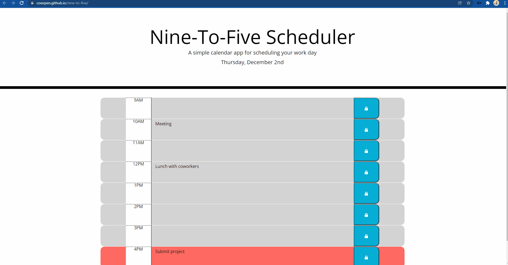

# Nine-to-Five Scheduler

## Purpose

I was given a challenge to finish a workday scheduler provided by a fictitious company. You can enter events in the text area corresponding to the hour of the day and click the corresponding button on the right to save it. If you refresh, the tasks should remain. The hours are color-coded based on whether that hour is in the past (grey), present (red), or future (green).

## About the process

I was provided the beginning html and CSS files. I edited in the divs for the timeblocks as well as placed in bootstrap code to add styling. I wrote the JavaScript file utilizing moment.js and jQuery. I added a set interval to check the hour every minute so the color-coding may change once an hour has passed. 

## Built With
* HTML
* CSS
* JavaScript 
* jQuery
* Bootstrap
* moment.js

## Website
https://coevpen.github.io/nine-to-five/

## Screenshot

